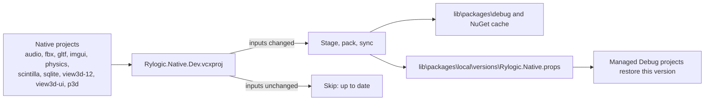

# Local development packages

Debug builds of the managed Rylogic libraries consume the native libraries through the `Rylogic.Native` NuGet package, the same way external users do.
To let local native changes flow into managed Debug builds without a release, every Debug|x64 build publishes a local development version of
`Rylogic.Native` into a local feed and the NuGet cache. This document describes how that works and what a fresh machine needs.

Release packages are a separate process; see [`.github/nuget-release.md`](../.github/nuget-release.md).

## Fresh machine setup

1. Install Visual Studio 2026 with the C++ desktop workload, the .NET 9 SDK, and `dotnet-script` (`dotnet tool install -g dotnet-script`).
2. Clone the repository and build `Rylogic.sln` in `Debug|x64` (or run `dotnet-script ./script/Build.csx -project AllNative -build`).

No manual package steps are needed:

- `nuget.config` registers the local feeds `lib\packages`, `lib\packages\debug`, and `lib\packages\release`. Their folders are kept in git
  (`.gitkeep`) so restore never fails because a local source is missing.
- `nuget.config` also registers `MicrosoftProtectedNuGet`, a protected proxy of nuget.org, for third-party packages. Do not add `api.nuget.org`
  directly; machines that block it will fail to restore.
- Until the first native Debug build publishes a development version, managed projects restore the stable `Rylogic.Native` version
  (`$(RylogicLibraryVersion)`) from the feeds. At run time, Debug builds still load the freshly built native DLLs from `lib\x64\Debug`.

## How a development version is published

- **One publish point.** `build\nuget\Rylogic.Native.Dev.vcxproj` (in `Rylogic.sln` under `Rylogic`) is the only project that publishes
  `Rylogic.Native` during a build. It references every project that contributes to the package, so all of them have finished building before it
  stages anything. A validation target fails the build if a project sets `RylogicNativeRuntimePackage` or `RylogicNativeLinkPackage` to `Include`
  but is not referenced by the aggregator.
- **Staging.** `script\StageNativeRuntimePackage.csx` copies the runtime DLLs, link libraries, tools, headers, and `build\Rylogic.Native.props` into
  a version-private folder under `obj\nuget\Rylogic.Native\x64\Debug\`. Each native project writes a runtime manifest when it builds; if any
  manifest or output is missing, the script reports what is missing and nothing is published.
- **Skip unchanged inputs.** The script hashes the content of every input and compares it with `obj\nuget\Rylogic.Native\x64\Debug\published.txt`
  (fingerprint, then version). When nothing changed and the published version is still in the NuGet cache, it prints
  `Rylogic.Native <version> is up to date.` and the build does not create a new version.
- **Versioning.** Each publish is `$(RylogicLibraryVersion)-dev.<UTC yyyyMMddHHmmssfff>`. NuGet treats a cached version as immutable, so changed
  content always needs a new version number.
- **Pointer.** `PublishLocalPackageVersion` writes the new version to `lib\packages\local\versions\Rylogic.Native.props` (and the central
  `lib\packages\local\packages\rylogic.native.props`). `Directory.Build.props` imports it for Debug `.csproj` builds as `$(RylogicNativePackageVersion)`.
  The pointer only moves forward, under a cross-process mutex.
- **Cache retention.** After the pointer advances, older owned development versions are removed from the NuGet cache, keeping the new version
  and the one it replaced. Managed projects in the same build restored against the replaced version before the publish, so it must stay available.
  Versions that are in use (for example a DLL loaded by a running process) are left alone and removed by a later publish.

Building a single native project in Visual Studio does not refresh the package. Build `Rylogic.Native.Dev` (or the solution) to publish.

## Opting out

Set `RylogicGeneratePackageOnBuild=false` to skip local package publishing, for example in `Directory.Build.user.props` (see
`Directory.Build.user.props.template`) or with `Build.csx -nopack`. Managed Debug builds then keep using the last published version.

## Troubleshooting

- **`NETSDK1064: Package Rylogic.Native, version 2.x.y-dev.N was not found`**: the restored version is no longer in the NuGet cache. Build
  `Rylogic.Native.Dev` (Debug|x64) to publish a fresh version, then restore again.
- **The aggregator reports an incomplete closure**: build the listed projects, or the whole solution, in Debug|x64.
- **The aggregator republishes on every build**: some input is rewritten with different bytes on each build. Compare file hashes before and
  after a no-change build to find it, and make the producing target incremental (`Inputs`/`Outputs`) rather than suppressing the publish.

## Rules for changing the build

These rules keep parallel (`/m`) and Visual Studio builds race-free:

- Never publish or delete shared outputs (packages, caches, version pointers, files under `lib\`) from per-project targets. Publish from a single
  project that depends on every producer.
- Never delete an artifact that a restore earlier in the same build may have resolved. Keep at least the previous version.
- Make publish steps idempotent: compare a content hash of the inputs and skip when unchanged. Keep version pointers monotonic.
- Custom targets that produce files must declare `Inputs` and `Outputs` so an unchanged build does not rewrite them.
- To add a project to `Rylogic.Native`, set its packaging property to `Include` and add a `ProjectReference` to `Rylogic.Native.Dev.vcxproj`.
- Verify build changes with two consecutive `/m` builds of `Rylogic.sln`: the first must succeed, and the second must report the package as up to date.
